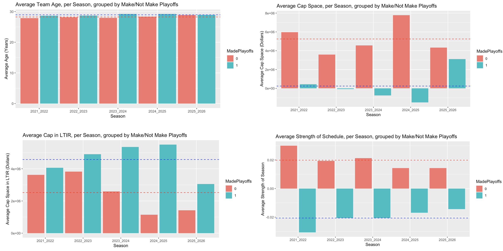
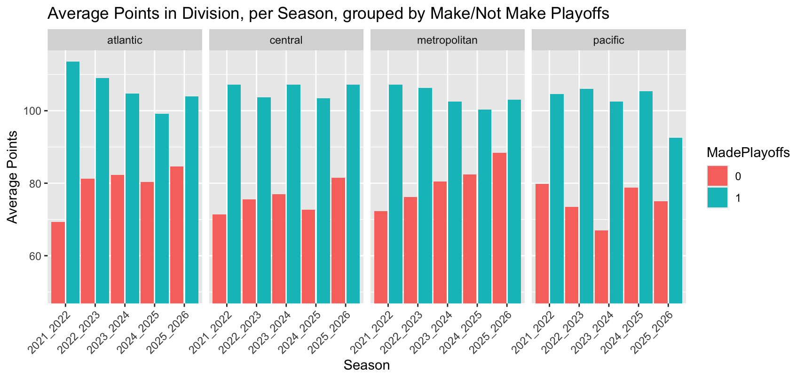

```{r echo=FALSE}
#the ONLY restrictions are that this should be approximately 5 pages
#there is no other information about the report
library(knitr)
```

## Introduction

In order to make the NHL season less fun, for this project we tried to predict which teams would make the playoffs this year, given the previous four years of data. If we were sportsbettors and made our bets early, perhaps we would get rich and drop out of school and sell our model to FanDuel or the evil DraftKings, but we have a desire to learn on a graduate student stipend. We know that whether or not a team makes the playoffs is dependent on the number of points they have after the last game of the season, which depends on the number of wins and overtime losses. In each division, the top three teams in terms of points will make the playoffs, and in each conference (two divisions per conference), the top two of the remaining ten teams will get wildcard bids to the playoffs. Using categorical data analysis methods, we worked with season-level NHL data available from hockey-reference.com and contract data from sportrac.com from the past five seasons to investigate whether we could predict playoff appearances from season data. 

## Data

The NHL as an organization is not typically interested in sharing the data they acquire about games, so there are few places to get good, publicly available data. The website hockey-reference (h-r) has good season level data, but doesn't have easily scrapeable game by game data. Sportrac was used as a cap reference. It is fairly accurate, but it does not have detailed information on player salaries. Ultimately we end up with 44 variables to choose from. We will sort these into categories based on their presumed collinearity. 

- **General information:** conference, division, average age (AvAge), games played (GP), season
- **Games-dependent**: wins (W), losses (OL), points (PTS), points percentage (PTS.), shootout wins (SOW), shootout losses (SOL)
- **Goals-dependent:** goals for (GF), goals against (GA), h-r rating (SRS), strength of schedule (SOS), goals for per game (GF.G), goals against per game (GA.G), power play goals (PP)... etc.
- **Situation-dependent:** powerplay opportunities (PPO), power play opportunities against (PPOA), penalty minutes per game (PIM.G)... etc.
- **Cap-dependent:** cap space, cap allocation (depends on season)
- **Money, but *not* cap-dependent:** dollars in long-term injured reserve (litr)
- **Response:** whether or not a team has made the playoffs, as 0 or 1 (MadePlayoffs)

When selecting variables to use to predict whether or not a team has made the playoffs, we want to make sure we don't have multiple from each category, because we know that we will have colinearity issues. For example, using GF and SOS wouldn't work, since strength of schedule is dependent on the average goals for and opponent average goals for. We end up selecting average age, cap space, LTIR, SOS, and division. We chose average age because we were looking for some metric for describing the player composition of a team as more or less experienced, cap space as a way to describe how expensive (in general, but not always) or how talented players are, LTIR as a way to quantify major player injuries, SOS so that we could consider whether a team has a challenging path to the playoffs or not, and division as we're dealing with only five years of data and it would be reasonable to see trends for stronger or weaker groups of teams. We also looked at points, which we did not include in our first models since points are a near perfect predictor of MadePlayoffs. 

For these variables we performed exploratory data analysis to investigate any obvious trends. 

```{r}
#| fig-cap: "Exploratory Data Analysis"
#| label: fig-eda
#| out.width: "100%"
#| echo: false
#| message: false
#| warning: false



```

In @fig-eda, we see that in the past five years the average age for teams making the playoffs is 28.9 while the average age for missing the playoffs is 28.2. This is a pretty small difference, and the only noticeable trend is that all teams are older on average this playoff year (2025-2026) than the years before. 

When looking at strength of schedule, SOS, we can see that teams making the playoffs tend to have a negative strength of schedule, -0.02 on average and teams who don't have a positive one, 0.02 on average. This means that teams that do make the playoffs have an "easier" schedule, playing teams that score fewer goals on average compared to playoff teams. This makes sense. SOS is a small number, and we also see that the difference in SOS between playoff and nonplayoff teams has been shrinking in the past five years. 

Cap space is a little weirder to interpret. There are multiple things to note here in. First, cap space is space *left over*, that a team is *not* spending. On average, teams who miss the playoffs have about \$5.25 million in cap space, so their players tend to be less expensive than teams that do make the playoffs. Second, the cap has changed in the past 5 years. The cap was has been increasing over the years, especially in the past two. Ultimately what is important to notice here is that the four-year pattern before the 2025-2026 season of playoff teams having very little if not negative cap space is not the case for our target season. 

LTIR, which measures how much money teams are spending by placing players in long term injured reserve, which essentially erases that player's salary and gives the team back that money to spend as long as the player is out for 10 games and 24 regular season days. There are lots of complicated rules about this, but the part relevant for us is that it's a sneaky way for teams to have more money to spend, if they can put an important player on LTIR before the playoffs, get an extra guy or two, and take that player off LTIR when the playoffs arise. It's less a proxy for injury and more for general manager strategy. We see that playoff teams have more money in LTIR, on average. 

```{r}
#| fig-cap: "Average Points by Division"
#| label: fig-avpts
#| out.width: "70%"
#| echo: false
#| message: false
#| warning: false



```

Finally we'll look at points over the last five years. We see obviously in @fig-avpts that playoff teams have more points than nonplayoff teams, and that this past season, the Pacific division was particularly weak. The Pacific, followed by the Central, tend to be weaker divisions while the Atlantic is much stronger. There isn't much of a clear trend besides this, but it is interesting to look at, and we likely would not see this clear of a trend if we looked at decades of data. 

Finally, it is *crucial* that we note our data are *not* independent. If my team wins all 82 games, no other team will win 82 games. The number of points, which does ultimately predict whether or not a team makes the playoffs, is not independent. In our group of predictors, SOS depends on the skill of other teams. We want to see what we can do with these models, but we remain cautious.

## First Attempts: Logistic Regression

Since our response `MakePlayoffs` is a binary variable, logistic regression is the natural choice of model. Our first model used only two predictors, `AvAge` and `SOS`. Using this model, we correctly predicted 19/32 of the playoff standings. 

We wanted more accuracy, so we decided to increase the model complexity. We used three new predictors in our second model: `division`, `cap_space`, and `ltir`. The results of the second model were a slight improvement: 22/32 correct standings. However, this model only predicted that ten teams would make the playoffs, which alerted us to a risk associated with predicting `MadePlayoffs` directly. We are not guaranteed to fill our playoff spots, or we may predict that too many teams make the playoffs.

These models did not perform as well as we had hoped. We think this is for two main reasons: first, we're compressing a long and very complicated season into just a few metrics. Second, the difference between making and missing the playoffs can often be a single point, or even a tiebreak. The features that define a playoff team are both hard to diagnose and often overlap with teams that do not make the playoffs.

```{r}
#| fig-cap: "Model Output, Logistic Regression"
#| label: fig-log12
#| out.width: "100%"
#| echo: false
#| message: false
#| warning: false


```

## Attempt 2: Poisson Regression

To guarantee that we found exactly the correct number of teams for the playoffs, we decided to predict points instead. Then, we can rank the teams within division and conference to select playoff teams by the NHL rules. We still used strategies from categorical data analysis, employing a log-linear model to predict points.

This model was a substantial improvement: 26/32 of the playoff standings were predicted correctly. 6 teams were mismatched in the Eastern Conference for the '25-'26 season, and all of the teams in the Western Conference were correctly placed.

## Attempt 3: Multinomial Logistic Regression with Win Categories

We also looked at a multinomial model. We organized wins into four equal width buckets and tried multinomial logistic regression, using the team's win bucket as a response. It turns out that for the post-COVID seasons, every team in the top bucket made playoffs, and the vast majority of teams in the second highest bucket also made playoffs. If we could predict those two categories reliably, we could predict the playoff teams with decent accuracy. Unfortunately, this did not pan out. This model performed the worst of everything we tried, with only fourteen of thirty-two buckets correctly predicted. Trying to predict playoffs with that sort of performance would have been nearly impossible, so the analysis stopped there. 

## Attempt 4: Recalculate Points and Try Method 2 Again

There is substantial debate about how the NHL calculates points, since the current format sometimes results in teams with relatively few regulation wins earning playoff spots due to a high number of overtime games. One commonly proposed alternative points system is the 3-2-1 system: 3 points for a regulation win, 2 points for overtime and shootout wins, and one point for overtime and shootout losses. For this final model, we recalculated points according to a 3-2-1 system and used it as the response in a log-linear model.

The results were identical to our second attempt. The team rankings were exactly the same, so our playoff teams were the same.

## Conclusion/future

Ultimately we find that predicting playoffs is a tough problem to solve and we probably shouldn't drop out of school. Categorical data analysis here may not be the right strategy (in fact, competing models don't use this strategy) since our categories have too many overlapping features. There are also of course lots of team changes happening during the season that are hard to keep track of, like lineups and injuries and things happening on opposing teams, which is very specific data, but even major change checkpoints like coaching changes or results of a trade deadline were not included. With a dynamic sport and a long season, it is not unreasonable to conclude that season-level data based on some sweeping averages is insufficient. In addition, we still have this issue of non-independence that is a problem for the models we're using here. The contemporary solution to this problem is machine learning, usually XGboost or something similar. We are testing the limits of traditional categorical data analysis.
