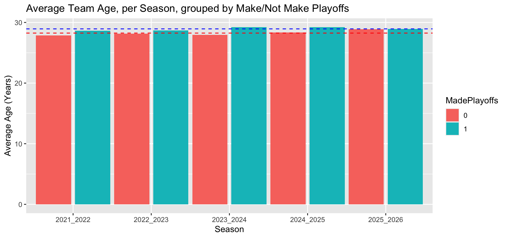
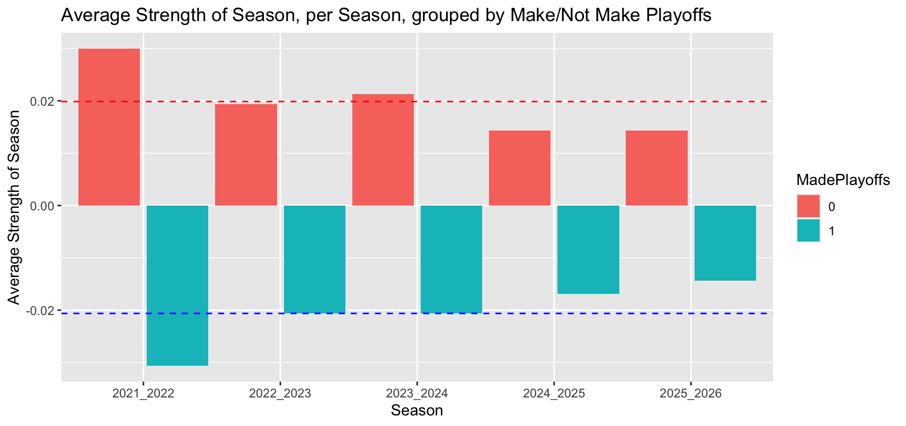
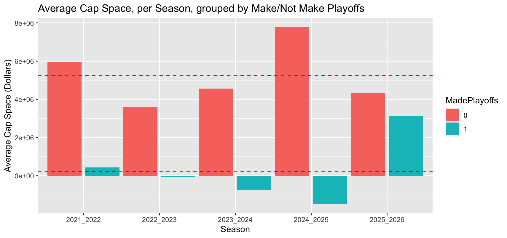
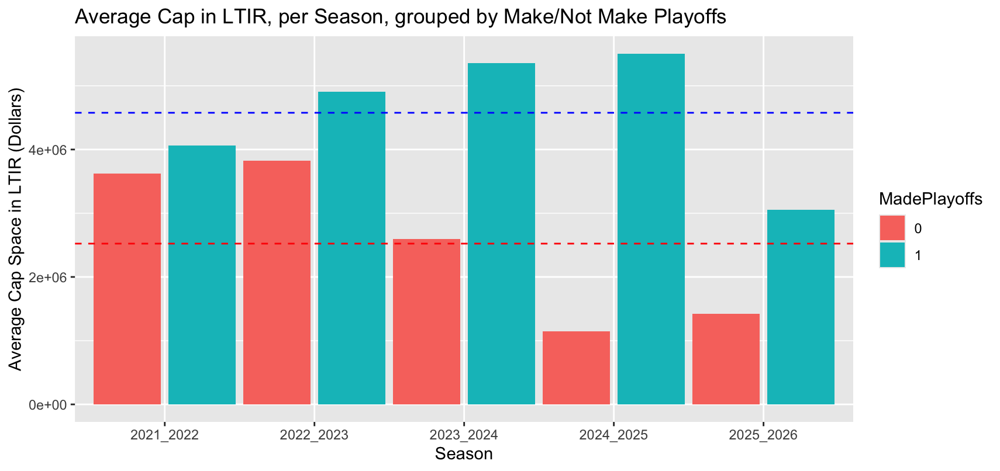

```{r}
#the ONLY restrictions are that this should be approximately 5 pages
#there is no other information about the report
library(knitr)
```

## Introduction

In order to make the NHL season less fun, for this project we tried to predict which teams would make the playoffs this year, given the previous four years of data. If we were sportsbettors and made our bets early, perhaps we would get rich and drop out of school and sell our model to FanDuel or the evil DraftKings, but we have a desire to learn on a graduate student stipend. We know that whether or not a team makes the playoffs is dependent on the number of points they have after the last game of the season, which depends on the number of wins and overtime losses. In each division, the top three teams in terms of points will make the playoffs, and in each conference (two divisions per conference), the top two of the remaining ten teams will get wildcard bids to the playoffs. Using categorical data analysis methods, we worked with season-level NHL data available from hockey-reference.com and contract data from sportrac.com from the past five seasons to investigate whether we could predict playoff appearances from season data. 

## Data

The NHL as an organization is not typically interested in sharing the data they acquire about games, so there are few places to get good, publicly available data. The website hockey-reference (h-r) has good season level data, but doesn't have easily scrapeable game by game data. The website capfriendly used to have good and up-to-date cap data, but it was purchased recently by the Washington Capitals, so sportrac was used as a replacement. It is fairly accurate, but it does not have detailed information on player salaries. Ultimately we end up with 44 variables to choose from. We will sort these into categories based on their presumed colinearity. 

- General information: conference, division, average age (AvAge), games played (GP), season
- Games-dependent: wins (W), losses (OL), points (PTS), points percentage (PTS.), shootout wins (SOW), shootout losses (SOL)
- Goals-dependent: goals for (GF), goals against (GA), h-r rating (SRS), strength of schedule (SOS), goals for per game (GF.G), goals against per game (GA.G), power play goals (PP), power play percentage (PP.), power play goals against (PPA), penalty kill percentage (PK.), shorthanded goals (SH), shorthanded goals against (SHA), shooting percentage (S.), shots on goal (S), shots against (SA), save percentage (SV.), shutouts (SO)
- Situation-dependent: powerplay opportunities (PPO), power play opportunities against (PPOA), penalty minutes per game (PIM.G), opponent penalty minutes per game (oPIM.G)
- Cap-dependent: cap space, cap allocation (depends on season)
- Money, but *not* cap-dependent: dollars in long-term injured reserve (litr)
- Response: whether or not a team has made the playoffs, as 0 or 1 (MadePlayoffs)

When selecting variables to use to predict whether or not a team has made the playoffs, we want to make sure we don't have multiple from each category, because we know that we will have colinearity issues. For example, using GF and SOS wouldn't work, since strength of schedule is dependent on the average goals for and opponent average goals for. We end up selecting average age, cap space, LTIR, SOS, and division. We chose average age because we were looking for some metric for describing the player composition of a team as more or less experienced, cap space as a way to describe how expensive (in general, but not always) or how talented players are, LTIR as a way to quantify major player injuries, SOS so that we could consider whether a team has a challenging path to the playoffs or not, and division as we're dealing with only five years of data and it would be reasonable to see trends for stronger or weaker groups of teams. We also looked at points, which we did not include in our first models since points are a near perfect predictor of MadePlayoffs. 

For these variables we performed exploratory data analysis to investigate any obvious trends. 

```{r}
#| fig-cap: "Average Team Age"
#| label: fig-avage
#| out.width: "70%"
#| echo: false
#| message: false
#| warning: false



```

In @fig-avage, we see that in the past five years the average age for teams making the playoffs is 28.9 while the average age for missing the playoffs is 28.2. This is a pretty small difference, and the only noticeable trend is that all teams are older on average this playoff year (2025-2026) than the years before. 

```{r}
#| fig-cap: "Average Strength of Schedule"
#| label: fig-avsos
#| out.width: "70%"
#| echo: false
#| message: false
#| warning: false



```

When looking at strength of schedule, SOS, in @fig-avsos we can see that teams making the playoffs tend to have a negative strength of schedule, -0.02 on average and teams who don't have a positive one, 0.02 on average. This means that teams that do make the playoffs have an "easier" schedule, playing teams that score fewer goals on average compared to playoff teams. This makes sense. SOS is a small number, and we also see that the difference in SOS between playoff and nonplayoff teams has been shrinking in the past five years. 

```{r}
#| fig-cap: "Average Cap Space"
#| label: fig-avcapspace
#| out.width: "70%"
#| echo: false
#| message: false
#| warning: false



```

Cap space is a little weirder to interpret. There are multiple things to note here in @fig-avcapspace. First, cap space is space *left over*, that a team is *not* spending. On average, teams who miss the playoffs have about \$5.25 million in cap space, so their players tend to be less expensive than teams that do make the playoffs. Second, the cap has changed in the past 5 years. in 2021-2022, the cap was \$81.5m, increasing to \$82.5m then \$83.5 in 2023-2024, as a result of the agreement reached during the shortened pandemic season in 2020-2021. Then, in 2024-2025, the cap increased to \$88m and is now this season \$95.5m. With that big of an increase, it is not shocking that playoff teams have lots of extra cap space since contracts have not yet adjusted to teams having significantly more money to spend. Finally, you will notice sometimes playoff teams have negative cap space. Sometimes that is cheating, sometimes that is a result of sportrac improperly dealing with LTIR, which we'll talk about next. Ultimately what is important to notice here is that the four-year pattern before the 2025-2026 season of playoff teams having very little if not negative cap space is not the case for our target season. 

```{r}
#| fig-cap: "Average $ in LTIR"
#| label: fig-avltir
#| out.width: "70%"
#| echo: false
#| message: false
#| warning: false



```

LTIR, which measures how much money teams are spending by placing players in long term injured reserve, which essentially erases that player's salary and gives the team back that money to spend as long as the player is out for 10 games and 24 regular season days. There are lots of complicated rules about this, but the part relevant for us is that it's a sneaky way for teams to have more money to spend, if they can put an important player on LTIR before the playoffs, get an extra guy or two, and take that player off LTIR when the playoffs arise. It's less a proxy for injury and more for general manager strategy. We see in @fig-avltir that playoff teams have more money in LTIR, on average. 

```{r}
#| fig-cap: "Average Points by Division"
#| label: fig-avpts
#| out.width: "70%"
#| echo: false
#| message: false
#| warning: false


knitr::include_graphics("ppdiv.png")
```

Finally we'll look at points over the last five years. We see obviously in @fig-avpts that playoff teams have more points than nonplayoff teams, and that this past season, the Pacific division was particularly weak. The Pacific, followed by the Central, tend to be weaker divisions while the Atlantic is much stronger. There isn't much of a clear trend besides this, but it is interesting to look at, and we likely would not see this clear of a trend if we looked at decades of data. 

Finally, it is *crucial* that we note our data are *not* independent. If my team wins all 82 games, no other team will win 82 games. The number of points, which does ultimately predict whether or not a team makes the playoffs, is not independent. In our group of predictors, SOS depends on the skill of other teams. We want to see what we can do with these models, but we remain cautious.

## First Try
> chris not sure how you want to organize these
Logistic regression + results
It was bad
Data are not independent

We think two main reasons why these models are struggling are because we're compressing a massive season's worth of data into very few metrics and the difference between make and miss playoffs can often be a single point or even a tiebreak. This "condition" is hard to diagnose, and its criteria in terms of points actually change every year, so it is understandable that predictors that aren't even points (our direct predictor) struggle. 

## Second Try

As a second attempt, we tried to predict points per team, so that we could then rank the teams within division and conference to select playoff teams by the NHL rules. We still used strategies from categorical data analysis, employing a log-linear model to predict points. 

>This was better! We can explain away errors (panthers especially) and point out what our model does well and what it struggles with

## Attempt 3?
buckets
This is maybe what we do with new points
A little counterintuitive, but what if we try to predict points where we weight regular season wins by 3pts OT/SO wins by 2 points (so we go in and change points for all training data) and then attempt 2 style predict and rank?
mutate(points2 = 3*RW + 2*OTW + 2*SOW + 1*OTL + 1*SOL), should be in full_data_with_overtimes with the reg wins
Might not work, depends on if we have the time

## Conclusion/future

Ultimately we find that predicting playoffs is a tough problem to solve and we probably shouldn't drop out of school. Categorical data analysis here may not be the right strategy (in fact, competing models don't use this strategy) since our categories have too many overlapping features. There are also of course lots of team changes happening during the season that are hard to keep track of, like lineups and injuries and things happening on opposing teams, which is very specific data, but even major change checkpoints like coaching changes or results of a trade deadline were not included. With a dynamic sport and a long season, it is not unreasonable to conclude that season-level data based on some sweeping averages is insufficient. In addition, we still have this issue of non-independence that is a problem for the models we're using here. 
> probably something about future models
